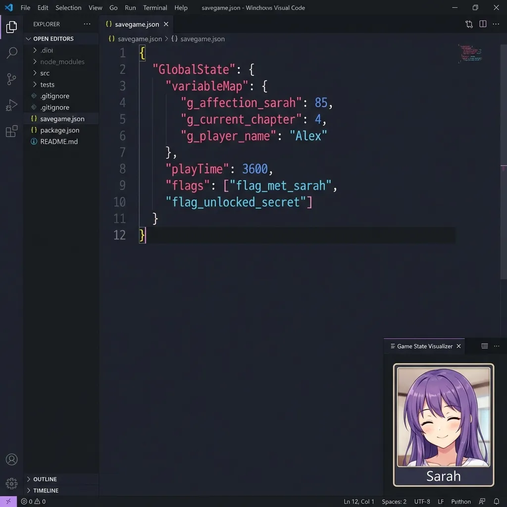

# Save Editor Online 💾

[](https://saveeditor.top)
[](https://opensource.org/licenses/MIT)
[](https://astro.build)

**The universal, privacy-focused online save file editor.**  
Edit your game saves directly in your browser. No uploads, no data collection, 100% local processing.

👉 **Start Editing Now:** [https://saveeditor.top](https://saveeditor.top)



## ✨ Features

*   **🔒 100% Private**: All logic runs client-side using WebAssembly and JavaScript. Your save files never leave your device.
*   **🌍 Universal Support**:
    *   **RPG Maker** (MV/MZ `.rpgsave`)
    *   **Unity** (PlayerPrefs, JSON, XML)
    *   **Ren'Py** (`.save` - Experimental)
    *   **Unreal Engine** (`.sav` - GVAS format)
    *   **GameMaker** (`.ini`, `.json`)
    *   **NaniNovel** (`.nson`)
    *   And many more generic formats (JSON, XML, Base64)!
*   **⚡ Instant Editing**: Visual tree editor for modifying gold, stats, items, and variables without coding knowledge.
*   **🌐 Multi-language**: English, Japanese (日本語), Korean (한국어), Portuguese (Português), Simplified Chinese (简体中文).

## 🚀 Supported Games

Works with thousands of games, including:
*   *Stardew Valley*
*   *Palworld*
*   *Vampire Survivors*
*   *Undertale* & *Deltarune*
*   *HoloCure*
*   *Doki Doki Literature Club*
*   *Deep Rock Galactic*

## 🛠️ Development

This project is built with [Astro](https://astro.build) and [React](https://reactjs.org).

### Prerequisites

*   Node.js 18+
*   npm

### Installation

```bash
# Clone the repository
git clone https://github.com/yourusername/save-editor-online.git

# Install dependencies
npm install

# Start development server
npm run dev
```

### Building for Production

```bash
npm run build
```

## 🤝 Contributing

Contributions are welcome! If you'd like to add support for a new game engine or fix a bug, please:

1.  Fork the repository.
2.  Create a feature branch (`git checkout -b feature/amazing-engine`).
3.  Commit your changes.
4.  Open a Pull Request.

## 📄 License

This project is licensed under the MIT License - see the [LICENSE](LICENSE) file for details.

---

*Disclaimer: This tool is for educational and personal use only. Always backup your save files before editing.*
