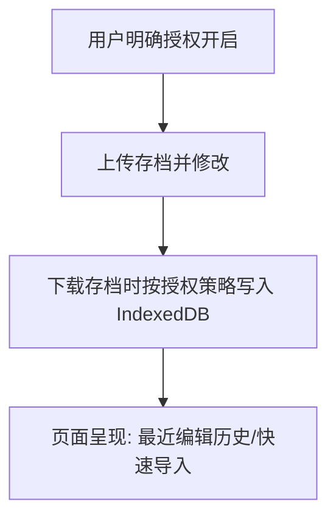

# 项目流量诊断与本地浏览器缓存优化方案报告

本报告针对当前项目网站的流量现状进行诊断，并提出以“用户授权的本地缓存”为核心的体验优化及回访率（Retention Rate）提升方案，同时针对 Bing 渠道依赖与合规变现问题进行探讨。

---

## 一、 流量现状诊断：GA4 与 Bing 官方数据对比

通过对比过去 30 天（2026年5月18日 - 2026年6月16日）的统计数据，我们发现 GA4 存在疑似统计漏报现象。

### 1. 数据对比与流失估算

| 数据源 | 指标项目 | 记录数据 | 数据说明 |
| :--- | :--- | :--- | :--- |
| **Bing Webmaster** | 过去30天点击数 | **12,100 次 (12.1K)** | Bing 侧统计的点击次数（与 GA4 会话存在统计口径差异） |
| **Google Analytics 4** | 过去30天 Bing 来源会话 | **1,725 次** | 包括 `cn.bing.com` (1,601) 与 `bing / organic` (124) |
| **数据流失比率** | **渠道数据差异** | **显著差异** | Bing 侧点击量显著高于 GA4 记录，疑似存在统计漏报 |

### 2. 漏报核心成因分析

1. **防火墙屏蔽 (GFW)**：项目核心用户群体主要位于中国大陆（GA4 活跃用户前几名城市为上海、广州、成都、北京等）。GA4 的收集域名 `googletagmanager.com` 在大陆被屏蔽，导致未开启全局代理的国内用户无法正常加载统计脚本。
2. **广告拦截率 (Ad-blockers)**：垂直游戏工具网站的玩家群体，使用 AdBlock、Brave 浏览器的比例偏高，直接拦截了 GA 的 JS 脚本加载。

### 3. 全站真实流量粗估上限
> [!NOTE]
> 以下推导仅基于 Bing 渠道的数据差异，口径不同且存在诸多变量，**仅作为流量体量的粗估上限与发展趋势参考，不作为确切的真实流量结论。**

以 Bing 渠道的数据倍率作为参考上限进行估算：
* **粗估活跃用户数 (Users) 上限**：约 2.8 万 ~ 3.0 万人（GA4 记录到 4,212）
* **粗估总会话数 (Sessions) 上限**：约 4.0 万 ~ 4.3 万次（GA4 记录到约 5,900）
* **粗估页面浏览量 (Pageviews) 上限**：约 8.5 万 ~ 9.5 万次（GA4 记录到 1.28 万）

---

## 二、 核心痛点与风险防范

### 1. 流量高度依赖 Bing 的风险
目前近一半流量来自 Bing 搜索。Bing 流量波动不可控，单一搜索渠道占比过高会放大流量风险。
* **对策**：必须将“搜索引擎流量”尽快转化为“**直接访问流量 (Direct)**”和“**书签/桌面应用流量**”。

### 2. 合规变现与防风控
国内流量的广告点击单价极低，且广告拦截率高。为了项目的长期健康发展，我们必须坚守合规底线，杜绝任何有版权、品牌及支付风控隐患的灰色引流或变现。
* **对策**：不进行任何卡密或灰色交易引流。仅限自愿赞助、合法游戏联盟分销（Affiliate）或自研工具增值功能。

---

## 三、 本地浏览器缓存（回访率提升方案）

为了将新用户转化为高频回访的老用户，我们建议在**充分保障用户隐私与知情权**的前提下，利用浏览器本地数据库（IndexedDB）落地缓存方案。

### 方案 1：显式授权的本地历史与备份（利用 IndexedDB）

* **业务痛点**：玩家修改存档最怕坏档，也经常需要在不同游戏进度中反复微调数值。
* **实施方案**：
  1. 使用浏览器 **IndexedDB**（容量大，适合存储大存档 Blob）在本地建立历史库。
  2. **隐私合规约束**：该功能**默认关闭**。在用户首次使用时通过明确的弹窗或引导提示，征得用户显式授权后方可开启。说明所有存档数据仅存储于用户本地浏览器，绝不上传服务器。
  3. 开启后，在用户下载新存档时，在本地保存最近的 5~10 个 `[原档备份]` 与 `[修改后备份]`。
  4. 页面顶部提供 `[最近编辑历史]` 面板，方便用户一键重新载入。
* **主要收益**：
  * 提供安全感，老用户改坏档后可随时回访本站一键恢复原档。
  * **第一阶段优先实施**。

### 方案 2：自定义“修改模板”缓存（利用 IndexedDB/LocalStorage）

* **业务痛点**：玩家需要对同一个游戏的多次修改重复勾选相同的属性（如金币满、属性满）。
* **实施方案**：
  1. 允许用户将当前修改的配置项保存为“我的模板”，方便后续一键套用，减少重复操作。
  2. **技术细节**：由于复杂大模板的结构较深且可能包含多维度数据，`LocalStorage` 读写慢且易因浏览器清理而丢失，故**复杂模板统一存入 IndexedDB**；`LocalStorage` 仅用于缓存轻量的 UI 偏好配置（如中英文语言切换、深色模式等）。

### 方案 3：静态资源离线缓存与 PWA 化（利用 Service Worker & Cache API）

* **评估与建议**：
  * 当前站点已经具备静态资源的长缓存配置，重复加载的流量消耗极低。
  * 引入 Service Worker 和完整 PWA 的边际收益相对有限，且会增加开发与调试成本。
  * **优先级调整**：**本方案列为第二阶段（远期）探索方案**。当前阶段应集中精力于“本地编辑历史 + 最近文件入口”的体验打磨。

---

## 四、 变现与合规配套战术

1. **收藏本站引导**：在用户成功下载存档的黄金时刻，弹出温和的友好提示，引导玩家按 `Ctrl + D` 将本站加入收藏夹，逐步沉淀为直接访问用户。
2. **自愿赞助友好提示**：
   * 在页面提供合规的第三方自愿打赏渠道（如爱发电、Ko-fi、Buy me a coffee 等）的入口。
   * **安全防范**：不将本地 `LocalStorage` 或前端变量作为付费权限的校验依据（用户可轻易修改本地缓存进行越权）。`LocalStorage` 仅用于记录“是否向用户展示过赞助提示”等自愿性质的 UI 交互状态。
3. **合法的 Affiliate (游戏分销合作)**：
   * 考虑与正规、合法的第三方分销平台合作，提供 Steam/GOG 等平台的游戏正版购买或充值折扣分销，确保商业化路径 100% 洁净，杜绝版权、支付、SEO 与主站品牌连带受损的风险。
4. **国际化（向 Google 拿高变现流量）**：
   * 持续优化英文、日文页面的翻译和热门海外游戏的支持。
   * 通过 GitHub 仓库沉淀高质量 Backlinks，提升在 Google 的自然搜索权重，逐步淡化对 Bing 单一渠道的绝对依赖。

---

## 五、 最佳执行路线图

1. **第一阶段 (当前核心)**：
   * [ ] 实施**需要用户显式授权**的本地编辑历史与最近文件快速载入入口（基于 IndexedDB）。
   * [ ] 在用户下载完存档后，引入友好的收藏本站（Ctrl+D）提示。
2. **第二阶段 (持续优化)**：
   * [ ] 实施基于 IndexedDB 的“修改配置模板保存（减少重复操作）”功能。
   * [ ] 挂载正规自愿赞助（爱发电等）以及合法的 Affiliate 分销链接。
3. **第三阶段 (长期规划)**：
   * [ ] 评估并尝试静态资源的 Service Worker / PWA 离线化改造。
